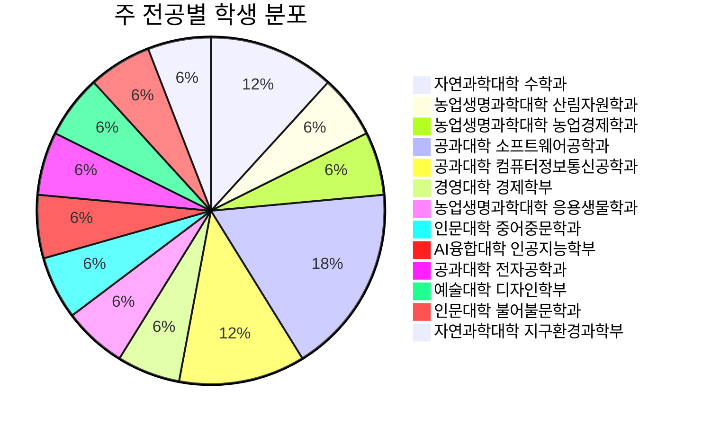
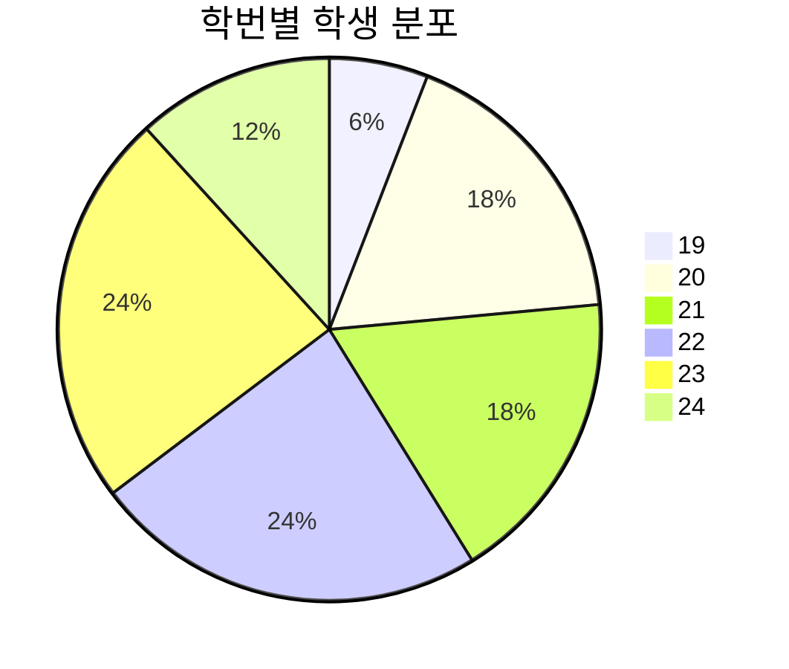
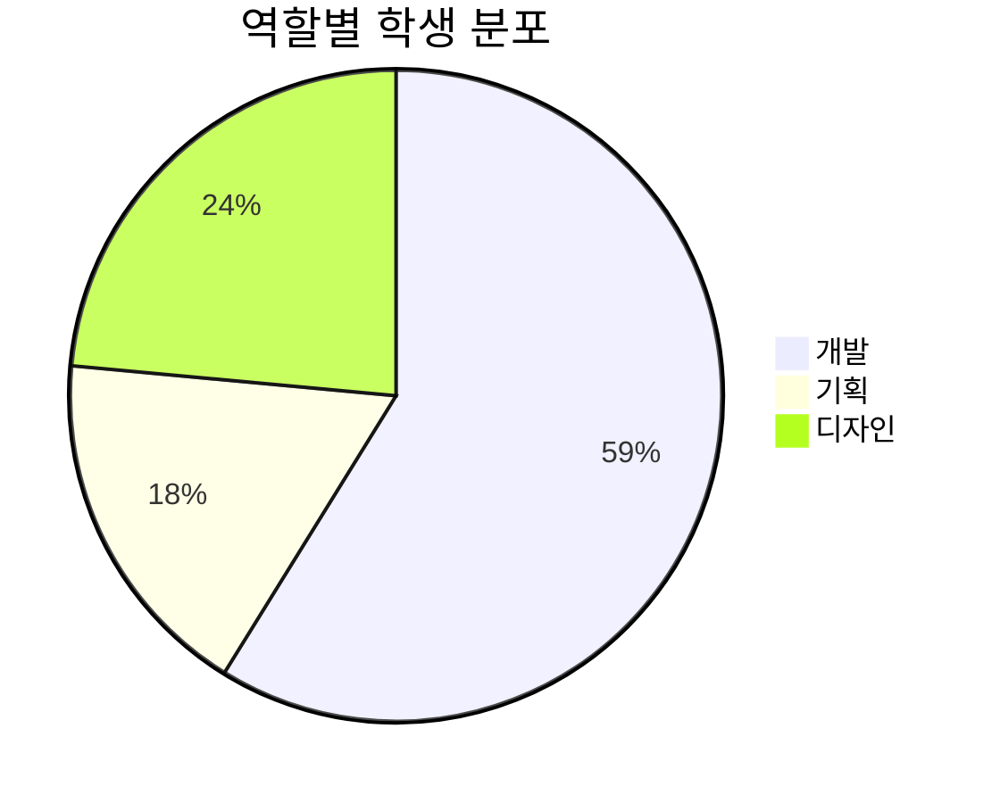
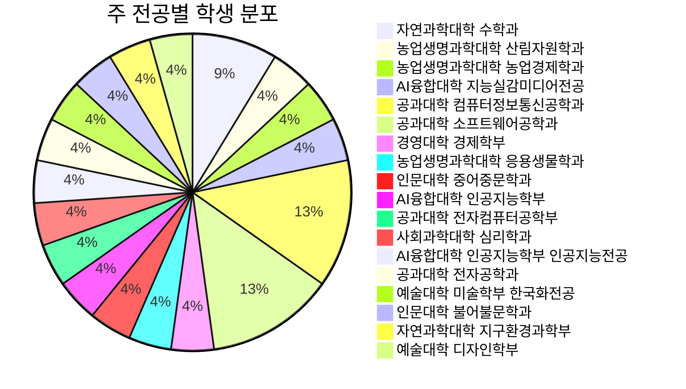
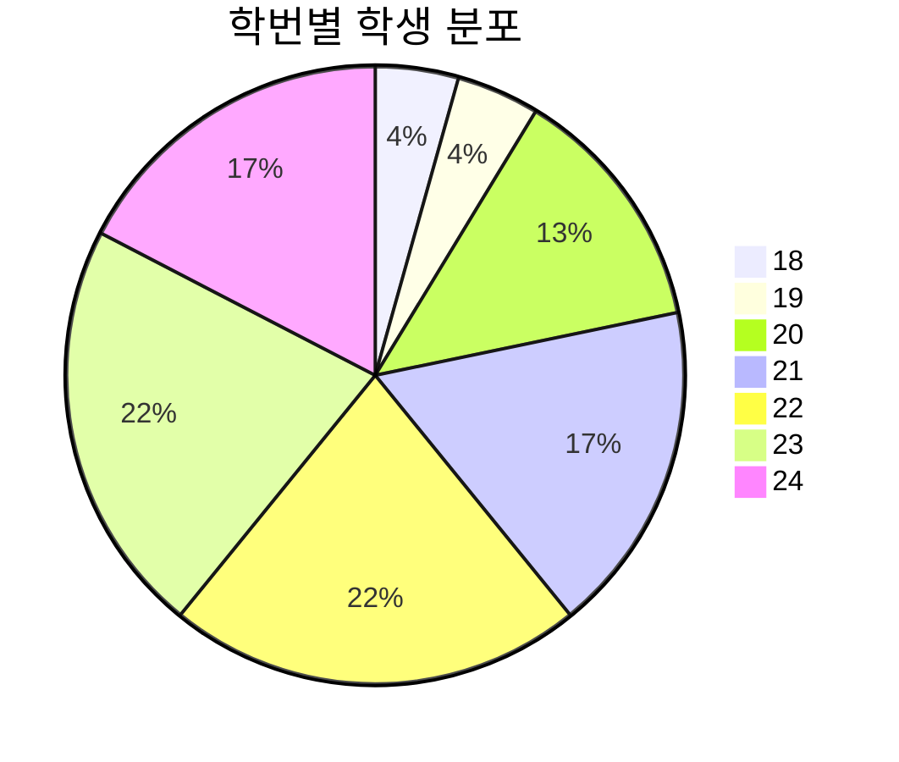
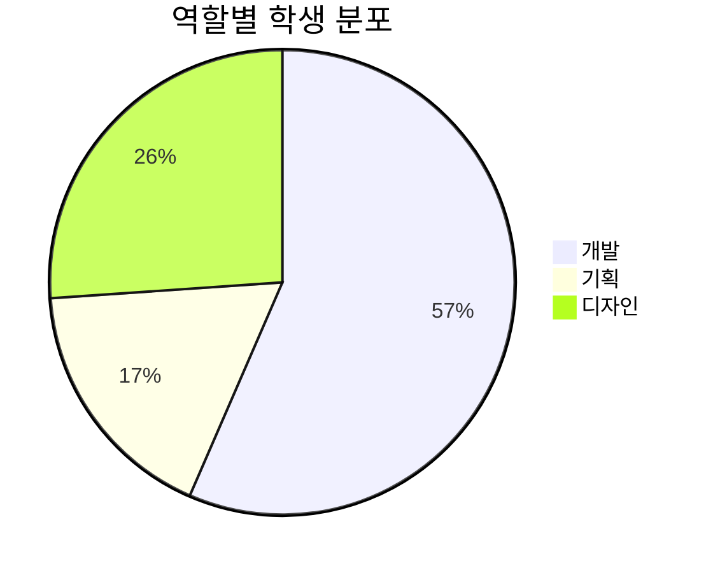

# facts

PIMM의 활동에 관한 주요한 사실들 정보공개

- [년도별 등록 활동 회원 통계](./registered-members/)

> [!NOTE]  
> 이 통계는 비활동 회원을 제외하고, 해당 학기에 활동 회원으로서 등록한 회원들의 정보를 기반으로 합니다.  
> 동아리의 활동 결과로서 동아리의 경향성을 나타내는 지표들이나, 동아리의 정책을 대표하지 않습니다.

---

# 2024학년도 1학기

## 주 전공별 학생 분포

## 학번별 학생 분포

## 역할별 학생 분포

# 2024학년도 2학기

## 주 전공별 학생 분포

## 학번별 학생 분포

## 역할별 학생 분포

